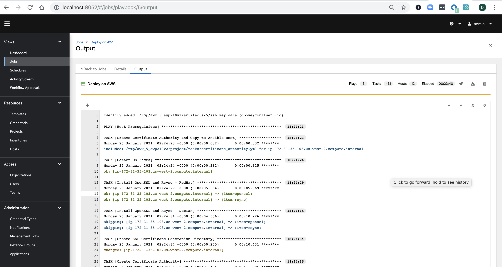

## Prerequisistes:
- [Docker](https://docs.docker.com/desktop/)
- [Docker Compose](https://docs.docker.com/compose/install/)

## Usage
Fork this repo

Clone your fork, best to use HTTPS because Tower needs access
```
export REPO_URL=https://github.com/domenicbove/tower-blog

git clone $REPO_URL
```

Provision AWS Infrastructure
```
export AWS_ACCESS_KEY_ID="key"
export AWS_SECRET_ACCESS_KEY="secret"
export TF_VAR_vpc_id=vpc-xxxx
export TF_VAR_subnet=subnet-xxxx

cd terraform
./provision.sh
```

Commit the updated inventory file, and push to your fork
```
git add terraform/hosts.yml
git commit -m 'Provisioned infrastructure and updated inventory file.'
git push origin master
```

Stand up Ansible Tower
```
cd awx
./start_tower.sh
```

Create CP-Ansible Job
```
./create_tower_job
```

Go to http://localhost:8052 in your browser and login with credentials admin/password

Under Jobs you can launch Deploy on AWS



## Next Steps
You now have a successful Confluent Platform Deployment automated with Ansible Tower.

Starting in CP-Anisble 6.1.0 we have added Reconfiguration. This means you can update the Job Template and add the tag "package" under the skip tags field. And you can add [Git Webhooks](https://docs.ansible.com/ansible-tower/latest/html/userguide/webhooks.html) as well. This amounts to any udates to your inventory in Git can trigger Ansible Tower to reconfigure your deployment in true GitOps fashion

## Future Ideas
The terraform code that enables this blog is great for demos, but is not a production set up. Code should be refactored into Terraform Modules. Autoscaling groups should be added to each ec2 instance. Potentially user data scripts could configure each host on start up.
